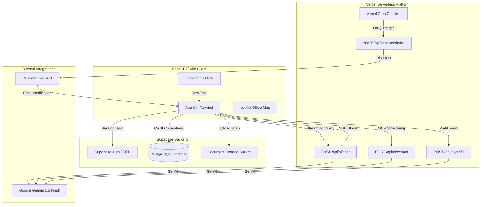

# DockIt 🏢⚖️

> **Enterprise-grade Compliance Discovery & Expiry Management for SMBs in India and the USA.**  
> *Never lose your business to an expired local or national license.*

[](https://react.dev/)
[](https://supabase.com/)
[](https://aistudio.google.com/)
[](https://vercel.com/)

---

## 📖 The Problem & Product Philosophy

Running a brick-and-mortar small business (restaurants, salons, retail, clinics) is a logistical battle. Municipal, state, and national regulations are scattered across archaic government portals. For a stressed, time-poor operator standing in a food truck or shop floor, checking compliance on a mobile phone shouldn't feel like navigating a complex enterprise SaaS dashboard.

**DockIt is built with strict utilitarian-but-sharp design guardrails:**
* **Mobile-First Utility**: Engineered to load fast and look legible on mid-range smartphones under direct sunlight.
* **Smart-Diff Interface**: When a user selects multiple jurisdictions, requirements dynamically merge in the UI using motion cues rather than blank page reloads.
* **Anti-AI-Slop Aesthetics**: Standard default fonts (Inter/Arial) and glowing purple gradients are replaced by structured typography, an off-white/slate legal-docket theme, and a single high-contrast accent carrying all urgency states.

---

## ⚡ Core Capabilities

### 1. AI-Powered OCR Ingestion
Scan physical paper licenses. DockIt performs client-side OCR via **Tesseract.js** to extract raw text, then relays it to a serverless **Gemini 1.5 Flash** parser to yield structured JSON containing issuing authority, license number, and exact expiry dates.

### 2. Cross-Border Smart-Diff Checklist
Dynamically maps compliance checklists for:
* **India (National & Municipal)**: FSSAI Food Licenses, Fire NOCs, Local Trade Licenses, Shops & Establishments Registrations, Eating House Licenses, and GST.
* **USA (Federal & Local)**: General Business Licenses, County Health Permits, State Sales Tax Permits, Fire Safety clearances, and FDA Registrations.

### 3. Automated Renewal Prefill Engine
Injects a merchant's business profile directly into the license metadata to pre-fill renewal forms, outputting a precise PDF checklist and step-by-step renewal portal directions.

### 4. Daily Cron & Multi-Stage Notifications
A daily serverless CRON checker queries licenses nearing expiration (60d, 30d, 7d, 1d) and dispatches branded email alerts via **Resend.com**, complete with localized penalty calculations and deep-links to the renewal portal.

### 5. Streaming AI Compliance Officer
An SSE (Server-Sent Events) streaming chatbot powered by Gemini, fully injected with the merchant's business profile, providing context-aware guidance on local licensing laws and penalties.

---

## 🗺️ System Architecture



---

## 🛠️ Project Structure

```
dockit/
├── api/                    ← Vercel Serverless Functions (Node.js)
│   ├── ai/
│   │   ├── extract.js      ← Gemini text parsing helper
│   │   ├── prefill.js      ← Pre-fill application details
│   │   └── chat.js         ← SSE Chat stream
│   ├── send-reminder.js    ← Resend integration
│   └── cron-check.js       ← Daily schedule scan
├── src/
│   ├── components/
│   │   ├── features/       ← ChatBot, OfficeLocator, PenaltyCalculator
│   │   ├── layout/         ← App layout, Sidebar navigation
│   │   └── ui/             ← ComplianceRing, SkeletonCard, StatusBadge
│   ├── context/
│   │   └── DemoContext.jsx ← Sandbox mode state manager
│   ├── services/
│   │   ├── supabase.js     ← Database client & authentication helpers
│   │   ├── geminiService.js← Gemini Client-side wrappers
│   │   ├── emailService.js ← Reminder dispatch helper
│   │   └── pdfService.js   ← Client-side PDF builder
│   ├── utils/
│   │   ├── licenseTypes.js ← Multi-country license checklists (IN & US)
│   │   ├── penaltyRules.js ← Penalty calculations & ordinances
│   │   ├── complianceScore.js ← Scoring algorithms
│   │   ├── demoData.js     ← Sandbox seed data (Mumbai restaurant)
│   │   └── formatters.js   ← Date & dynamic currency formatting (₹ / $)
│   └── main.jsx
├── supabase/
│   ├── schema.sql          ← Row-Level Security definitions & schema
│   └── seed.sql            ← Local demo sandbox data
├── vercel.json             ← Serverless endpoint & Cron config
└── tailwind.config.js
```

---

## 🚀 Local Quick Start

### 1. Clone & Dependencies
```bash
git clone https://github.com/NavjotSingh20/DockIt.git
cd DockIt
npm install
```

### 2. Database Initialization
1. Spin up a new PostgreSQL project at [supabase.com](https://supabase.com).
2. Open the **SQL Editor** and run the contents of [`supabase/schema.sql`](file:///c:/Users/navjo/OneDrive/Desktop/DockIt/supabase/schema.sql).
3. In the Supabase dashboard, navigate to **Storage** and create a private bucket named `license-documents`.
4. Go to **Authentication** → **Providers** and ensure **Email OTP** or password authentication is enabled.

### 3. Environment Setup
Create a `.env.local` file in the root directory:
```env
# Supabase Configuration
VITE_SUPABASE_URL=https://your-project.supabase.co
VITE_SUPABASE_ANON_KEY=eyJhbGci...

# Google Gemini API Key
GEMINI_API_KEY=AIzaSy...

# Resend Email Integration
RESEND_API_KEY=re_...

# Cron Job Protection Key
CRON_SECRET=my-local-secret-123
```
> ⚠️ **Important:** Server-side keys (`GEMINI_API_KEY`, `RESEND_API_KEY`) **must not** contain the `VITE_` prefix to prevent exposure in client bundles.

### 4. Running the Dev Environment
Start the frontend development server:
```bash
npm run dev
```

To test serverless backend API routes (`/api/*`) locally, use the Vercel CLI:
```bash
npm install -g vercel
vercel dev
```

---

## 🏛️ Supported Jurisdictions

### India (National & Local)
* **FSSAI Food License**: Regulated by the FSS Act, 2006.
* **Fire NOC**: Compliance under State Fire & Emergency Services.
* **Trade License**: Local Municipal Corporations.
* **Shops & Establishments**: State Labour Department rules.
* **Eating House**: Municipal Police Commissionerate clearances.
* **GST**: National Goods & Services Tax registration.

### United States (Federal & Local)
* **General Business License**: Municipal/County compliance.
* **Health Permit**: Regional County Department of Health rules.
* **Sales Tax Permit**: State Department of Revenue registration.
* **Fire Permit**: City Fire Marshal / Safety clearances.
* **FDA Registration**: Federal Food Facility registration (FD&C Act).

---

## ⚖️ Penalty Estimator Engine
Calculates compounding financial exposure and regulatory consequences dynamically based on the merchant's location:
* **India (INR)**: Compounding fines ranging from late fees of ₹1,000 up to statutory fines of ₹5,00,000 for critical operations.
* **USA (USD)**: Late penalties starting at $100 progressing to county health grade downgrades, and forced shut-down citations.

---

## 📝 License
Distributed under the MIT License. Built for hackathon demonstration.

*Designed and Built for Small Businesses Worldwide — DockIt 2026*
